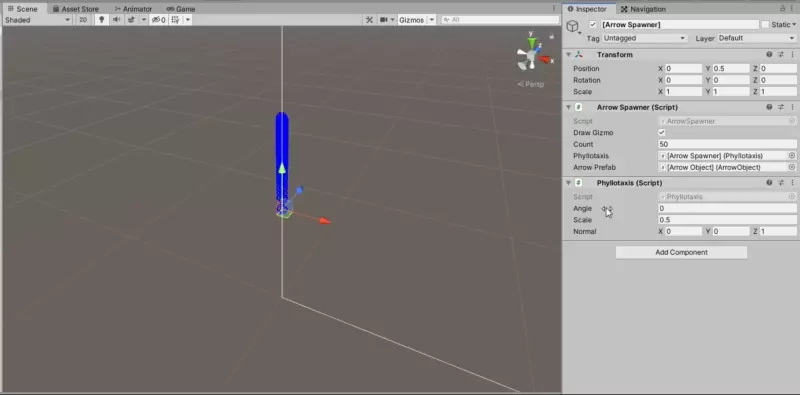

# Arrow-Fest-Unity-Clone
 
## Description
Project template for making <i>hyper-casual</i> clones of [Arrow Fest](https://play.google.com/store/apps/details?id=com.nanotribe.games.arrowfest) and <i>similar</i> games.

Procedural unit placement is made by using [Phyllotaxis pattern](http://algorithmicbotany.org/papers/abop/abop-ch4.pdf) :exploding_head: :nerd_face: :star_struck:

## Showcase

<table>
  <tr>
    <td>
      
    </td>
  </tr>
</table>

## Credits
- [Peer Play](https://www.youtube.com/channel/UCBkub2TsbCFIfdhuxRr2Lrw) (math of phyllotaxis)
